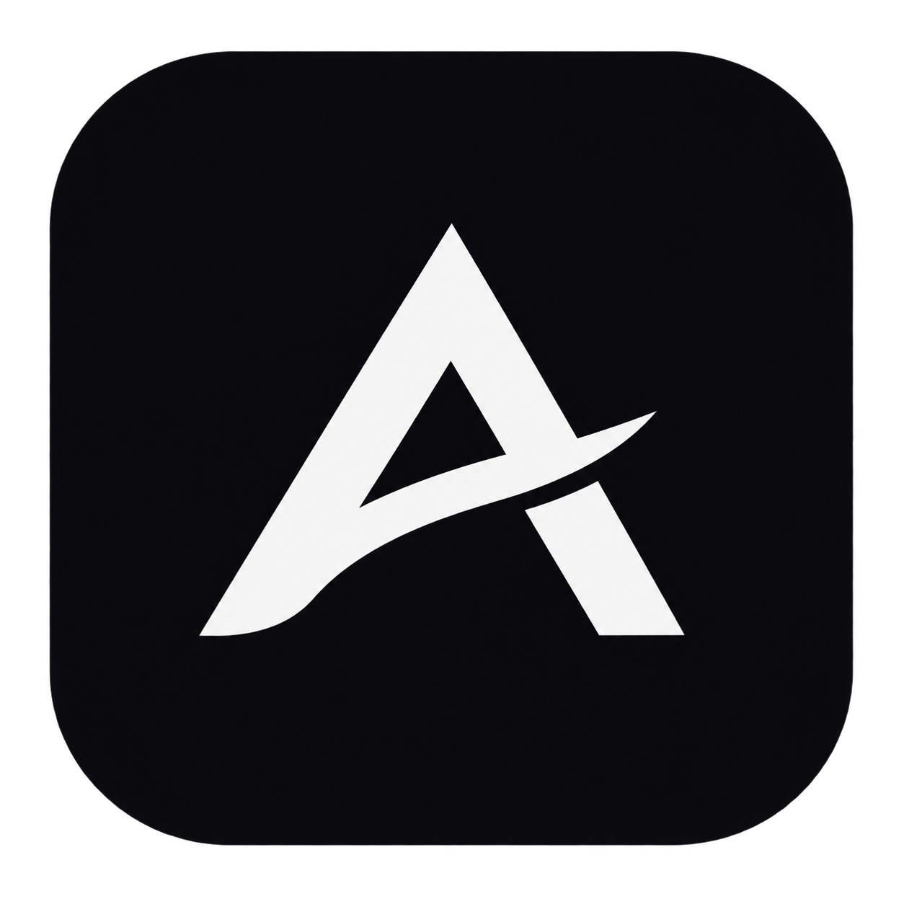

  

<h1 align="center">Aniting</h1>

  <b>A native cross-platform application to watch anime and read manga all in one place.</b>

  <a href="README.md"><b>English</b></a> •
  <a href="README.es.md">Español</a>

  
  
  

---

## 🌟 Key Features

- 🎬 **Anime Streaming**: Smooth playback through online stream providers and torrent streaming with advanced styled subtitles (`.ass`), audio track selection, and subtitle sync.
- 📖 **Manga Reader**: Built-in reader supporting both vertical (webtoon) and horizontal (traditional manga) reading modes.
- 📴 **Autonomous Offline Mode (No Account Required)**: Watch anime and read manga right away without needing an AniList account. The app automatically tracks your reading/watching history, continue watching/reading queues, and lists locally on your device.
- 🔄 **AniList Sync**: Optional cloud sync with AniList to keep your progress and library synced across devices.
- 🧩 **Extensions Marketplace**: Install community-created extensions for anime sources, torrent indexers, and manga providers.
- ⚡ **Mobile & Battery Optimized**: Low-RAM footprint with proactive memory management and full Android 14+ compatibility.

---

## 📱 Android Installation

1. Go to the [**Official Releases**](https://github.com/anyyting-es/aniting/releases/latest).
2. Download the version suitable for your device:
   - **`app-arm64-v8a-release.apk`** *(Recommended)*: For 99% of modern Android smartphones (smaller download, faster performance, lower RAM usage).
   - **`aniting-universal-release.apk`**: Universal build compatible with any Android phone or tablet.
   - **`app-x86_64-release.apk`**: For PC Android emulators (BlueStacks, Android Studio, Waydroid).
   - **`app-armeabi-v7a-release.apk`**: For older 32-bit Android legacy devices.
3. Open the APK on your phone and install it. *(If prompted, enable "Install unknown apps" for your browser or file manager)*.
4. Launch Aniting and enjoy! Future updates can be installed seamlessly from within the app.

---

## 🖥️ Desktop & TV

- **Android (Mobile)**: Primary supported platform.
- **Desktop (Windows / Linux / macOS) & Android TV**: Early development stage. Continually improving with future updates.

---

## 💬 Community & Support

Join our Discord community:
- **Discord**: [discord.gg/FaPcNGURdN](https://discord.gg/FaPcNGURdN)

> 💡 *The Discord server is brand new and pretty empty right now, but feel free to chat about anything in the general channel, say hi, share feedback, or report bugs!*

---

## ❤️ Credits & Acknowledgements

Aniting is powered by the backend and ecosystem architecture of [Seanime](https://github.com/5rahim/seanime), developed by [5rahim](https://github.com/5rahim). All credits go to their incredible work on the server and extension ecosystem.
